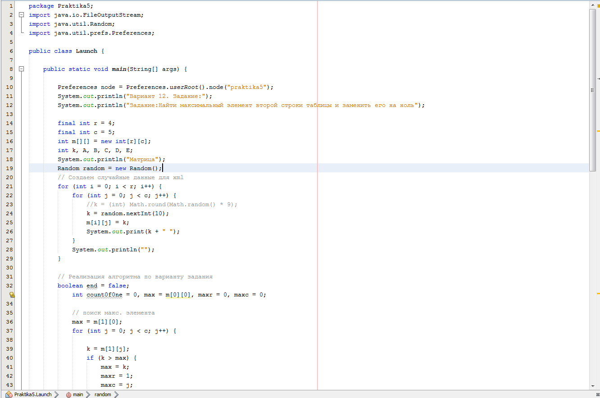
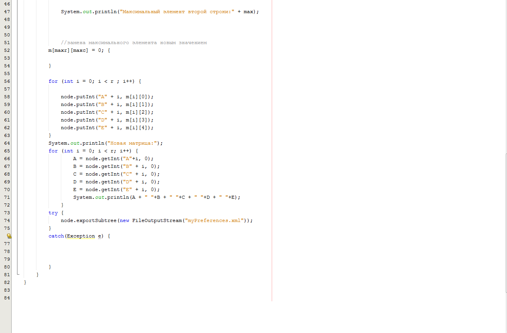
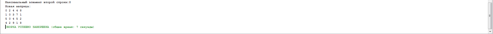
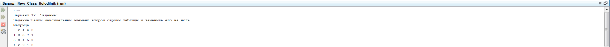

| Фамилия, имя студента | Группа    | Дисциплина  |Тема                              
| --------------------- |:---------:| ------------|:--------------------------------:|
| Федоренко Виталий     | ИС-302    | ООП         |5. Работа с Preferences |

Практика №5 вариант 12, суть задания: Найти максимальный элемент второй строки таблицы и заменить его на ноль.
Скриншот кода 5 задания:

Скриншоты вывода 5 задания:

